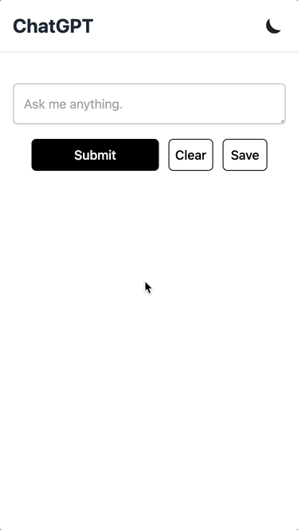
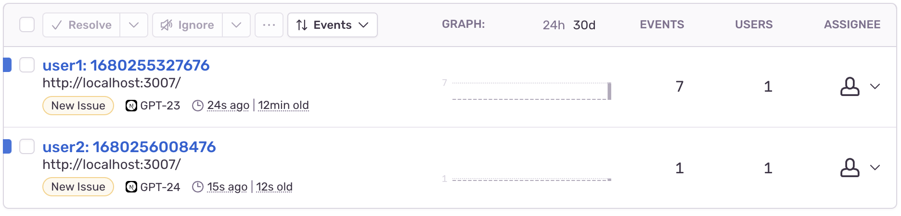

# Deploy your private ChatGPT



English | [中文](./README-CN.md)

The purpose of this repository is to enable you to easily deploy your own private ChatGPT website. You can use your own OpenAI screct key, set password to the enviroment variables, deploy it, and share the website with your friends!

It has the following basic features:

- Streaming data
- Server-side rendering
- Code block highlighting
- Responsive Design
- Dark mode
- Save conversations as an image
- Sentry monitor

List of technologies used:

- Next.js
- React.js
- Tailwindcss
- Sentry
- Vercel

## Steps

### Step 1

Go to [OpenAI platform](https://platform.openai.com/account/api-keys) to get your secret key.

### Step 2

Fork this repo. (and star it, btw :D)

### Step 3

Go to [Vercel](https://vercel.com/new) (or any other deploy method you prefer) and find the repository you have just forked.

### Step 4

Before you hit the deploy button, add some `Environment Variables` are necessary:

1. `OPENAI_API_KEY`: This is your OpenAI secret key generated in step 1.
2. `PASSWORD`: This is a simple authorization strategy where you can add one or multiple passwords (separated by commas) and share the password with your partners.
3. `MODEL`: Optional, a model of the API, default to 'gpt-3.5-turbo'.

now, hit the deploy button, that's it! (You can bind your own domains later)

## More

You can create a password for each of your friends that represents their name, so that you can access Sentry and see each person's usage and any potential error events within Sentry. You can directly integrate Sentry through Vercel.



## Development

install the dependencies:

```bash
npm i
```

add `.env.local` to the root directory.

```bash
OPENAI_API_KEY=your_openai_secret_key
PASSWORD=user1,user2
```

Now you can start it:

```bash
npm run dev
```

Finally, open <http://localhost:3007>
